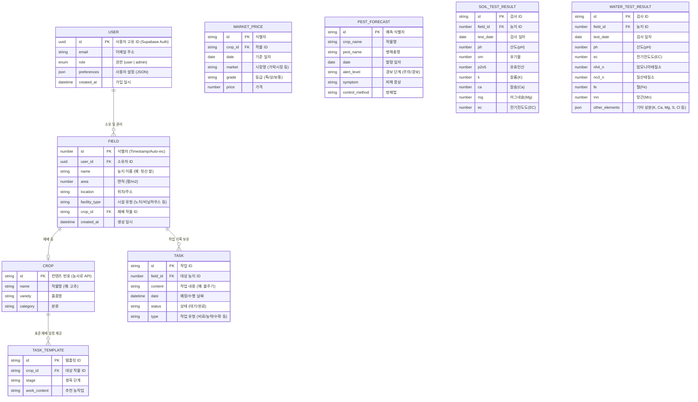

# 꿈을 그리는 농장 - ERD 데이터 설계도

이 문서는 현재 코드 분석과 기획을 바탕으로 **꿈을 그리는 농장** 애플리케이션의 데이터 구조를 정의한 ERD(Entity Relationship Diagram)입니다.

## 개체 관계 다이어그램 (ERD)

## 데이터 사전 (Data Dictionary)

### 1. User (사용자)
- **출처 (Source)**: `js/services/authService.js`
- **설명**: Supabase Auth를 통해 관리되는 사용자 계정 정보입니다.
- **주요 속성**: `id` (UUID), `role` (사용자/관리자 구분).

### 2. Field (농지)
- **출처 (Source)**: `js/components/fields.js`, `js/services/farmService.js`
- **설명**: 사용자가 등록하여 관리하는 개별 농지 정보입니다.
- **저장소**: 
    - (현재) 브라우저 `localStorage` (Key: `my_fields`)
    - **(향후)** NAS 구축 시 DB(MariaDB/PostgreSQL)로 이관 권장
- **주요 속성**: `name` (이름), `area` (면적), `location` (위치).

### 3. Crop (작물)
- **출처 (Source)**: `js/api/nonsaro.js` (외부 API)
- **설명**: 농사로(공공데이터) API에서 가져온 표준 작물 데이터 및 품종 정보입니다.
- **주요 속성**: `id` (식별자), `name` (작물명).

### 4. Task (농작업 일정 - 기획 중)
- **출처 (Source)**: `PROJECT_GOAL.md` (기획 문서)
- **참조 데이터**: 농사로 '농작업 일정 정보', '농사로 공통코드'.
- **설명**: 각 농지에서 수행해야 할 일별 농작업 스케줄입니다.

### 5. Market Price (도매 시세)
- **출처**: 공공데이터 포털 (농수산식품유통공사 도매시장 정산정보)
- **설명**: 작물의 일별 도매 시장 경매/정산 가격 정보입니다.
- **주요 속성**: `date`, `market`, `price`, `grade`.

### 6. Pest Forecast (병해충 예측)
- **출처**: NCPMS (국가농작물병해충관리시스템)
- **설명**: 기상 정보와 작물 생육 단계를 기반으로 한 병해충 발생 예측 정보입니다.
- **활용**: '농심(Farmers Mind)' 알림 서비스의 핵심 데이터.

### 7. Soil/Water Test Results (토양/수질 검사 결과 - 사용자 입력)
- **출처**: 사용자가 직접 입력 (시비처방서 및 시험결과서 기반)
- **설명**: 개별 농지의 토양 및 농업용수 분석 결과 이력입니다.
- **주요 속성**:
    - **토양**: `test_date`, `ph`, `om`(유기물), `ec`
    - **수질**: `test_date`, `ph`, `ec`, `no3_n`, `nh4_n`
