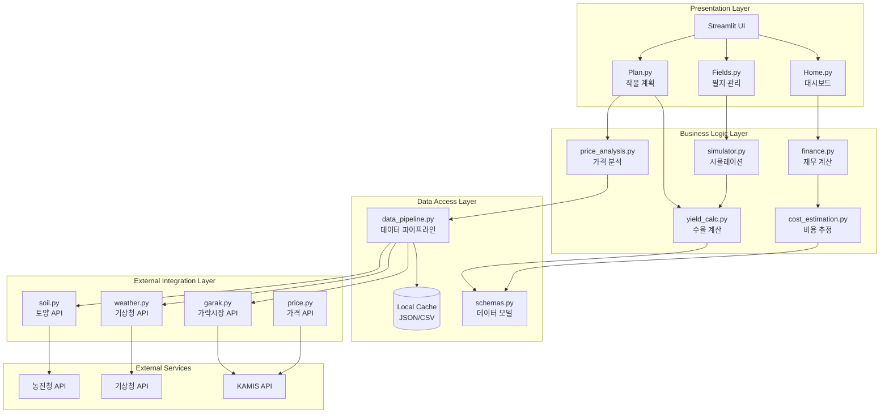
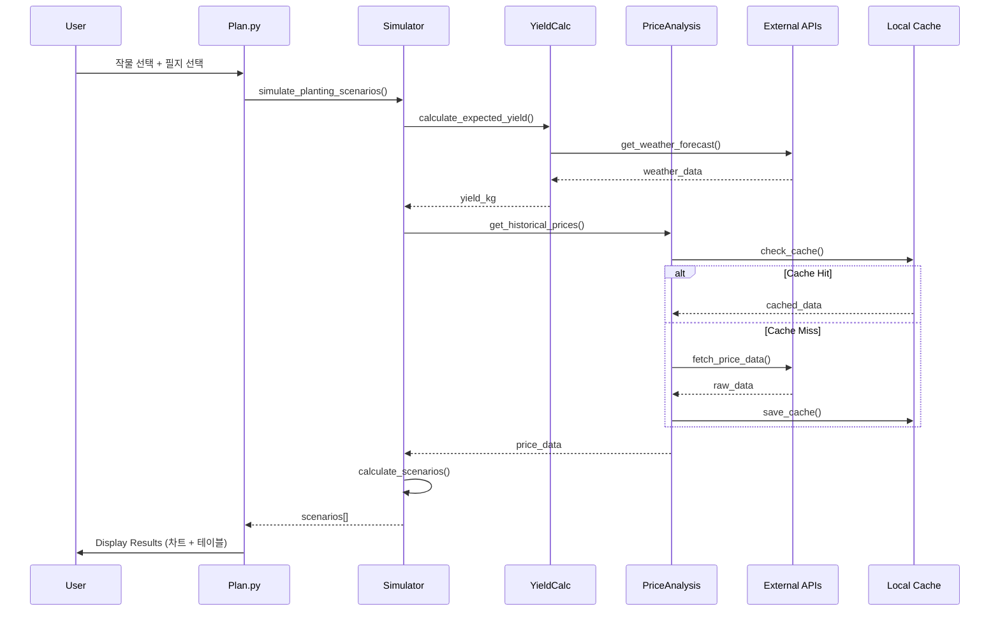
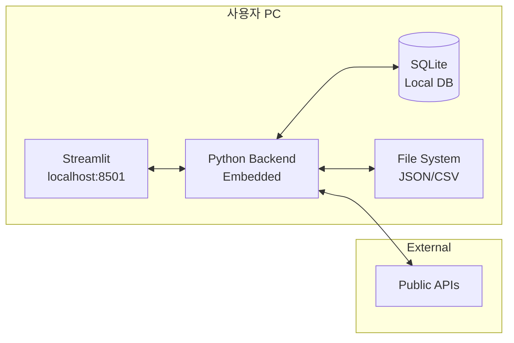
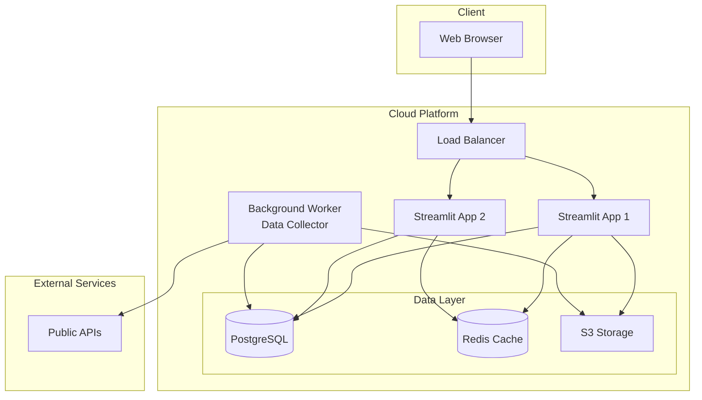

# 시스템 아키텍처 설계서
## Farm Calculator System Architecture

---

## 📋 목차
1. [아키텍처 개요](#아키텍처-개요)
2. [시스템 계층 구조](#시스템-계층-구조)
3. [컴포넌트 다이어그램](#컴포넌트-다이어그램)
4. [데이터 흐름](#데이터-흐름)
5. [배포 아키텍처](#배포-아키텍처)
6. [확장성 고려사항](#확장성-고려사항)

---

## 아키텍처 개요

### 아키텍처 원칙

#### 1. 계층 분리 (Layered Architecture)
```
┌─────────────────────────────────┐
│   Presentation Layer (UI)        │  ← Streamlit Frontend
├─────────────────────────────────┤
│   Business Logic Layer           │  ← Services & Core Logic
├─────────────────────────────────┤
│   Data Access Layer              │  ← Models & Repositories
├─────────────────────────────────┤
│   External Integration Layer     │  ← API Clients
└─────────────────────────────────┘
```

#### 2. 핵심 설계 원칙
- **단일 책임 원칙 (SRP)**: 각 모듈은 하나의 명확한 책임
- **의존성 역전 (DIP)**: 추상화에 의존, 구체에 비의존
- **로컬 우선 (Local-First)**: 네트워크 없이도 동작
- **느슨한 결합 (Loose Coupling)**: 모듈 간 독립성 유지

---

## 시스템 계층 구조

### 전체 아키텍처 다이어그램



---

## 컴포넌트 다이어그램

### 1. Presentation Layer (프론트엔드)

#### 구조
```
frontend/
├── Home.py                 # 메인 대시보드
├── pages/
│   ├── 1_Fields.py        # 필지 관리
│   └── 2_Plan.py          # 작물 계획
└── styles.py              # 공통 스타일
```

#### 책임
- 사용자 인터랙션 처리
- 데이터 시각화 (차트, 테이블)
- Session State 관리
- 입력 검증 (1차)

#### 주요 컴포넌트

| 컴포넌트 | 파일 | 역할 |
|----------|------|------|
| Dashboard | Home.py | 통합 현황, 메트릭 표시 |
| Field Manager | Fields.py | 필지 CRUD, 토양 정보 |
| Crop Planner | Plan.py | 작물 선택, 시뮬레이션 |
| Style Manager | styles.py | 공통 CSS, 테마 |

---

### 2. Business Logic Layer (비즈니스 로직)

#### 구조
```
backend/services/
├── finance.py              # 재무 계산
├── simulator.py            # 시나리오 시뮬레이션
├── yield_calc.py           # 수율 계산
├── cost_estimation.py      # 비용 추정
└── price_analysis.py       # 가격 분석
```

#### 핵심 서비스

##### finance.py
```python
# 수익/비용 계산
def calculate_revenue(yield_kg: float, price_per_kg: float) -> float
def calculate_expense(area: float, crop: str) -> float
def calculate_profit(revenue: float, expense: float) -> float
def calculate_roi(profit: float, expense: float) -> float
```

##### simulator.py
```python
# 시뮬레이션 엔진
def simulate_planting_scenarios(field: Field, crop: Crop) -> List[Scenario]
def find_optimal_planting_date(scenarios: List[Scenario]) -> date
def compare_crops(field: Field, crops: List[Crop]) -> DataFrame
```

##### yield_calc.py
```python
# 수율 계산
def calculate_expected_yield(area: float, crop: str, weather: dict) -> float
def calculate_harvest_date(planting_date: date, crop: str) -> date
def adjust_yield_by_weather(base_yield: float, weather: dict) -> float
```

##### price_analysis.py
```python
# 가격 분석
def get_historical_prices(crop: str, years: int = 5) -> DataFrame
def find_golden_time(crop: str) -> DateRange
def predict_future_price(crop: str, target_date: date) -> float
```

---

### 3. Data Access Layer (데이터 접근)

#### 구조
```
backend/
├── models/
│   └── schemas.py          # Pydantic 모델
└── services/
    └── data_pipeline.py    # 데이터 파이프라인
```

#### 데이터 모델 (schemas.py)

```python
from pydantic import BaseModel, Field
from datetime import date
from typing import List, Optional

class FarmField(BaseModel):
    """필지 정보"""
    id: str
    name: str
    location: str
    area: float  # 제곱미터
    facility_type: str  # "노지", "비닐하우스", "유리온실"
    soil_ph: Optional[float] = None
    
class CropPlan(BaseModel):
    """작물 계획"""
    field_id: str
    crop: str
    variety: str
    planting_date: date
    expected_harvest_date: date
    
class SimulationResult(BaseModel):
    """시뮬레이션 결과"""
    planting_date: date
    harvest_date: date
    expected_yield: float  # kg
    estimated_revenue: float  # 원
    estimated_expense: float  # 원
    net_profit: float  # 원
    roi: float  # %
    
class PriceData(BaseModel):
    """가격 데이터"""
    date: date
    crop: str
    price: float
    unit: str
    grade: str
    source: str
```

#### 데이터 파이프라인 (data_pipeline.py)

```python
class DataPipeline:
    """데이터 수집 및 처리 파이프라인"""
    
    def __init__(self):
        self.cache_dir = Path("data/cache")
        self.raw_dir = Path("data/raw")
        self.processed_dir = Path("data/processed")
        
    def collect_price_data(self, crop: str, days: int = 30):
        """가격 데이터 수집"""
        # 1. API 호출
        # 2. 캐시 확인
        # 3. 데이터 정규화
        # 4. 저장
        
    def get_cached_data(self, key: str, max_age_hours: int = 24):
        """캐시된 데이터 조회"""
        
    def process_raw_data(self):
        """원본 데이터 가공"""
```

---

### 4. External Integration Layer (외부 연동)

#### 구조
```
backend/api_clients/
├── garak.py               # 가락시장 API
├── weather.py             # 기상청 API
├── soil.py                # 토양 API
└── price.py               # 가격 API (통합)
```

#### API 클라이언트 패턴

```python
from abc import ABC, abstractmethod
import requests
from typing import Optional, Dict

class BaseAPIClient(ABC):
    """API 클라이언트 베이스"""
    
    def __init__(self, api_key: Optional[str] = None):
        self.api_key = api_key
        self.base_url = self.get_base_url()
        self.timeout = 10
        
    @abstractmethod
    def get_base_url(self) -> str:
        pass
        
    def _make_request(self, endpoint: str, params: Dict) -> Dict:
        """공통 요청 로직"""
        try:
            response = requests.get(
                f"{self.base_url}/{endpoint}",
                params=params,
                timeout=self.timeout
            )
            response.raise_for_status()
            return response.json()
        except Exception as e:
            logger.error(f"API 요청 실패: {e}")
            return {}
            
class GarakClient(BaseAPIClient):
    """가락시장 API 클라이언트"""
    
    def get_base_url(self) -> str:
        return "https://www.garak.co.kr/publicdata"
        
    def get_daily_price(self, item: str, date: str) -> Dict:
        return self._make_request("itemPriceSearch", {
            "item": item,
            "date": date
        })
```

---

## 데이터 흐름

### Use Case: 작물 계획 시뮬레이션



### 데이터 흐름 요약

#### 읽기 흐름 (Read Path)
1. **UI 요청** → Session State 확인
2. **Business Logic** → 계산 수행
3. **Data Layer** → 캐시 확인
4. **External API** (캐시 미스 시)
5. **역방향 전달** → UI로 결과 표시

#### 쓰기 흐름 (Write Path)
1. **UI 입력** → 검증
2. **Session State** 업데이트
3. **Local Storage** (JSON/CSV) 저장
4. **Background** → 주기적 백업

---

## 배포 아키텍처

### 로컬 배포 (현재)



### 특징
- **단일 프로세스**: Streamlit이 백엔드 포함
- **로컬 스토리지**: SQLite + JSON/CSV
- **직접 API 호출**: 중간 서버 없음

### 향후 클라우드 배포 (옵션)



---

## 확장성 고려사항

### 1. 데이터 확장성

#### 현재 (Local)
- SQLite: 단일 사용자, 적은 데이터량
- JSON/CSV: 파일 기반, 간단한 구조

#### 확장 옵션
- **PostgreSQL**: 다중 사용자, 대용량 데이터
- **Redis**: 캐싱 레이어 추가
- **S3/Cloud Storage**: 파일 스토리지 분리

### 2. 성능 확장성

#### 캐싱 전략
```python
# 3-tier 캐싱
1. Memory Cache (st.session_state)
   ↓ miss
2. File Cache (JSON, 24시간)
   ↓ miss
3. API Call (실시간)
```

#### 비동기 처리
```python
# 백그라운드 데이터 수집
import threading

def background_collect():
    """백그라운드에서 가격 데이터 수집"""
    while True:
        time.sleep(3600)  # 1시간마다
        collect_all_price_data()
        
threading.Thread(target=background_collect, daemon=True).start()
```

### 3. 모듈 확장성

#### 플러그인 아키텍처 (향후)
```python
# services/plugins/
class BaseAnalysisPlugin:
    def analyze(self, data): pass
    
class CustomAnalysis(BaseAnalysisPlugin):
    def analyze(self, data):
        # 사용자 정의 분석
        pass
```

---

## 보안 아키텍처

### API 키 관리
```
config/
├── .env                    # 로컬 환경변수 (gitignore)
└── .env.example            # 템플릿
```

### 데이터 보호
- **로컬 저장**: 사용자 PC에만 저장
- **암호화**: 민감 정보는 암호화 (향후)
- **백업**: 사용자가 직접 관리

---

## 모니터링 및 로깅

### 로깅 전략
```python
from loguru import logger

# 구조화된 로깅
logger.add(
    "logs/app_{time}.log",
    rotation="1 day",
    retention="30 days",
    level="INFO"
)

# 사용
logger.info("API 호출", crop="토마토", date="2026-01-01")
logger.error("데이터 처리 실패", error=str(e))
```

### 에러 추적
- **계층별 에러 핸들링**
- **사용자 친화적 메시지**
- **로그 기록 (디버깅용)**

---

## 다음 단계

### 구현 우선순위
1. ✅ 기본 아키텍처 확립
2. 🔧 데이터 파이프라인 강화
3. 📊 캐싱 시스템 구현
4. 🎨 UI 컴포넌트 모듈화
5. 🧪 테스트 커버리지 확대

---

**문서 버전**: 1.0  
**작성일**: 2026-01-01  
**검토 상태**: 설계
