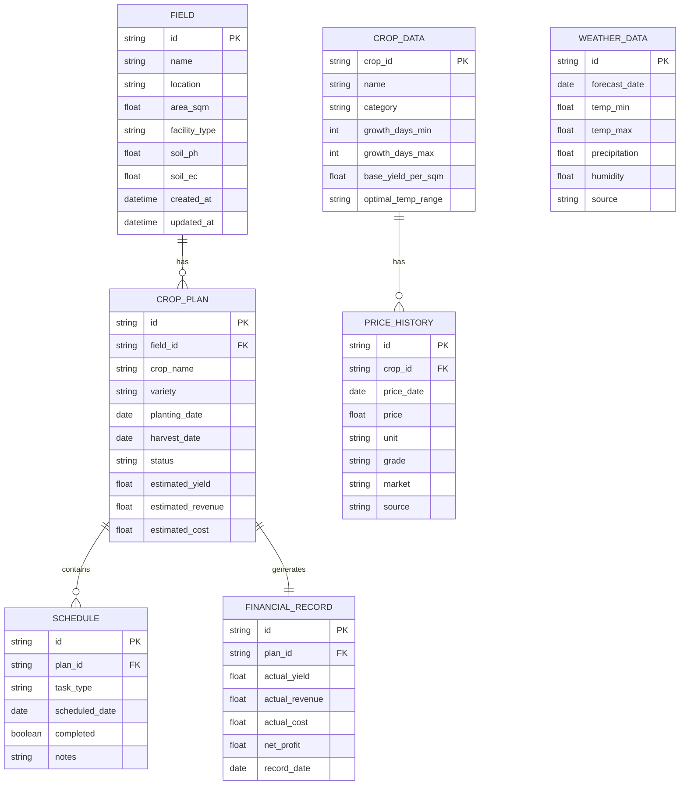
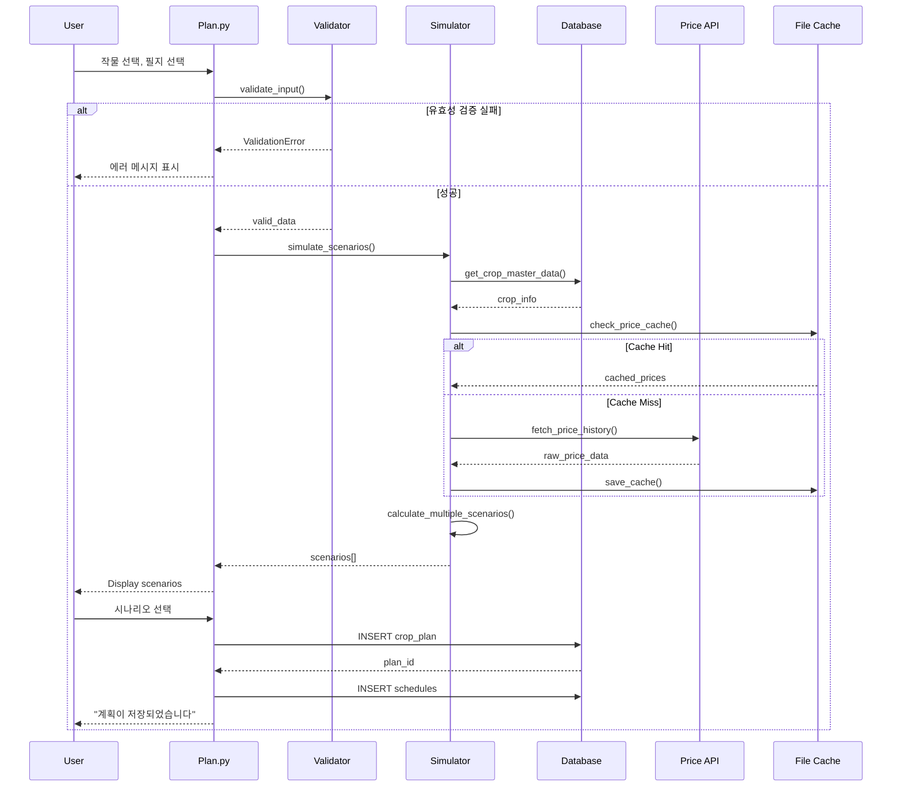
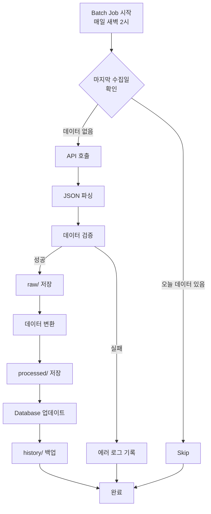
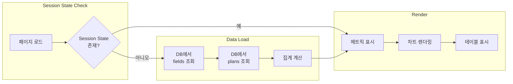

# 데이터 흐름도 및 구조 설계서
## Data Flow & Structure Design

---

## 📋 목차
1. [데이터 모델 개요](#데이터-모델-개요)
2. [Entity Relationship Diagram](#entity-relationship-diagram)
3. [데이터베이스 스키마](#데이터베이스-스키마)
4. [API 데이터 구조](#api-데이터-구조)
5. [파일 시스템 구조](#파일-시스템-구조)
6. [데이터 흐름 시나리오](#데이터-흐름-시나리오)
7. [상태 관리](#상태-관리)

---

## 데이터 모델 개요

### 핵심 엔티티



---

## Entity Relationship Diagram

### 관계 설명

#### 1. FIELD ↔ CROP_PLAN (1:N)
- 하나의 필지는 여러 작물 계획을 가질 수 있음
- 한 작물 계획은 하나의 필지에만 속함

#### 2. CROP_PLAN ↔ SCHEDULE (1:N)
- 하나의 작물 계획은 여러 작업 일정을 포함
- 각 일정은 하나의 계획에만 속함

#### 3. CROP_PLAN ↔ FINANCIAL_RECORD (1:1)
- 각 작물 계획은 하나의 재무 기록을 생성
- 수확 후 실제 수익/비용 기록

#### 4. CROP_DATA ↔ PRICE_HISTORY (1:N)
- 작물 마스터 데이터는 여러 가격 이력을 보유
- 5년간 일별 가격 데이터 축적

---

## 데이터베이스 스키마

### 1. fields 테이블

```sql
CREATE TABLE fields (
    id TEXT PRIMARY KEY,
    name TEXT NOT NULL,
    location TEXT,
    area_sqm REAL NOT NULL CHECK(area_sqm > 0),
    area_pyeong REAL GENERATED ALWAYS AS (area_sqm / 3.3) VIRTUAL,
    facility_type TEXT CHECK(facility_type IN ('노지', '비닐하우스', '유리온실', '스마트팜')),
    
    -- 토양 정보
    soil_ph REAL CHECK(soil_ph BETWEEN 0 AND 14),
    soil_ec REAL CHECK(soil_ec >= 0),
    soil_organic_matter REAL,
    soil_nitrogen REAL,
    soil_phosphorus REAL,
    soil_potassium REAL,
    
    -- 메타데이터
    created_at TIMESTAMP DEFAULT CURRENT_TIMESTAMP,
    updated_at TIMESTAMP DEFAULT CURRENT_TIMESTAMP,
    is_active BOOLEAN DEFAULT TRUE
);

CREATE INDEX idx_fields_active ON fields(is_active);
```

### 2. crop_plans 테이블

```sql
CREATE TABLE crop_plans (
    id TEXT PRIMARY KEY,
    field_id TEXT NOT NULL,
    
    -- 작물 정보
    crop_name TEXT NOT NULL,
    crop_variety TEXT,
    
    -- 일정
    planting_date DATE NOT NULL,
    expected_harvest_date DATE NOT NULL,
    actual_harvest_date DATE,
    
    -- 추정치
    estimated_yield_kg REAL,
    estimated_revenue REAL,
    estimated_cost REAL,
    estimated_profit REAL,
    
    -- 상태
    status TEXT CHECK(status IN ('계획', '진행중', '수확완료', '취소')) DEFAULT '계획',
    
    -- 참고
    notes TEXT,
    
    -- 메타데이터
    created_at TIMESTAMP DEFAULT CURRENT_TIMESTAMP,
    updated_at TIMESTAMP DEFAULT CURRENT_TIMESTAMP,
    
    FOREIGN KEY (field_id) REFERENCES fields(id) ON DELETE CASCADE
);

CREATE INDEX idx_plans_field ON crop_plans(field_id);
CREATE INDEX idx_plans_status ON crop_plans(status);
CREATE INDEX idx_plans_dates ON crop_plans(planting_date, expected_harvest_date);
```

### 3. schedules 테이블

```sql
CREATE TABLE schedules (
    id TEXT PRIMARY KEY,
    plan_id TEXT NOT NULL,
    
    task_type TEXT CHECK(task_type IN ('파종', '정식', '비료', '방제', '관수', '수확', '기타')),
    scheduled_date DATE NOT NULL,
    completed BOOLEAN DEFAULT FALSE,
    completed_at TIMESTAMP,
    
    notes TEXT,
    
    created_at TIMESTAMP DEFAULT CURRENT_TIMESTAMP,
    
    FOREIGN KEY (plan_id) REFERENCES crop_plans(id) ON DELETE CASCADE
);

CREATE INDEX idx_schedules_plan ON schedules(plan_id);
CREATE INDEX idx_schedules_date ON schedules(scheduled_date);
CREATE INDEX idx_schedules_pending ON schedules(completed, scheduled_date);
```

### 4. financial_records 테이블

```sql
CREATE TABLE financial_records (
    id TEXT PRIMARY KEY,
    plan_id TEXT NOT NULL UNIQUE,
    
    -- 실제 수익
    actual_yield_kg REAL,
    actual_price_per_kg REAL,
    actual_revenue REAL,
    
    -- 실제 비용
    seed_cost REAL DEFAULT 0,
    fertilizer_cost REAL DEFAULT 0,
    pesticide_cost REAL DEFAULT 0,
    labor_cost REAL DEFAULT 0,
    utility_cost REAL DEFAULT 0,
    other_cost REAL DEFAULT 0,
    total_cost REAL GENERATED ALWAYS AS (
        seed_cost + fertilizer_cost + pesticide_cost + 
        labor_cost + utility_cost + other_cost
    ) VIRTUAL,
    
    -- 손익
    net_profit REAL GENERATED ALWAYS AS (actual_revenue - total_cost) VIRTUAL,
    roi REAL GENERATED ALWAYS AS (
        CASE WHEN total_cost > 0 
        THEN ((actual_revenue - total_cost) / total_cost * 100)
        ELSE NULL END
    ) VIRTUAL,
    
    record_date DATE NOT NULL,
    notes TEXT,
    
    created_at TIMESTAMP DEFAULT CURRENT_TIMESTAMP,
    updated_at TIMESTAMP DEFAULT CURRENT_TIMESTAMP,
    
    FOREIGN KEY (plan_id) REFERENCES crop_plans(id) ON DELETE CASCADE
);

CREATE INDEX idx_financial_date ON financial_records(record_date);
```

### 5. crop_master 테이블 (마스터 데이터)

```sql
CREATE TABLE crop_master (
    crop_id TEXT PRIMARY KEY,
    name_kr TEXT NOT NULL,
    name_en TEXT,
    category TEXT,  -- '채소', '과채', '과일', '곡물'
    
    -- 재배 정보
    growth_days_min INTEGER,
    growth_days_max INTEGER,
    optimal_temp_min REAL,
    optimal_temp_max REAL,
    
    -- 수율 정보
    base_yield_per_sqm REAL,  -- 기본 수율 (kg/m²)
    
    -- 코드 매핑 (API용)
    kamis_code TEXT,
    garak_code TEXT,
    
    created_at TIMESTAMP DEFAULT CURRENT_TIMESTAMP,
    updated_at TIMESTAMP DEFAULT CURRENT_TIMESTAMP
);

CREATE INDEX idx_crop_name ON crop_master(name_kr);
```

### 6. price_history 테이블

```sql
CREATE TABLE price_history (
    id TEXT PRIMARY KEY,
    crop_id TEXT NOT NULL,
    
    price_date DATE NOT NULL,
    price REAL NOT NULL,
    unit TEXT,  -- '10kg상자', '20kg상자', 'kg'
    grade TEXT,  -- '특', '상', '중', '하'
    market TEXT,  -- '가락', '강서', '전국평균'
    source TEXT,  -- 'KAMIS', 'GARAK_API', 'MANUAL'
    
    created_at TIMESTAMP DEFAULT CURRENT_TIMESTAMP,
    
    FOREIGN KEY (crop_id) REFERENCES crop_master(crop_id),
    
    UNIQUE(crop_id, price_date, unit, grade, market)
);

CREATE INDEX idx_price_crop_date ON price_history(crop_id, price_date);
CREATE INDEX idx_price_date ON price_history(price_date);
```

### 7. weather_cache 테이블

```sql
CREATE TABLE weather_cache (
    id TEXT PRIMARY KEY,
    
    forecast_date DATE NOT NULL,
    location_x INTEGER NOT NULL,
    location_y INTEGER NOT NULL,
    
    temp_min REAL,
    temp_max REAL,
    precipitation REAL,
    humidity REAL,
    weather_code TEXT,
    
    source TEXT DEFAULT 'KMA',
    fetched_at TIMESTAMP DEFAULT CURRENT_TIMESTAMP,
    
    UNIQUE(forecast_date, location_x, location_y)
);

CREATE INDEX idx_weather_date ON weather_cache(forecast_date);
```

---

## API 데이터 구조

### Pydantic 모델 (schemas.py)

#### 1. Field 모델
```python
from pydantic import BaseModel, Field, validator
from typing import Optional
from datetime import datetime

class FieldBase(BaseModel):
    name: str = Field(..., min_length=1, max_length=100)
    location: Optional[str] = None
    area_sqm: float = Field(..., gt=0)
    facility_type: str = Field(..., pattern="^(노지|비닐하우스|유리온실|스마트팜)$")

class FieldCreate(FieldBase):
    soil_ph: Optional[float] = Field(None, ge=0, le=14)
    soil_ec: Optional[float] = Field(None, ge=0)

class FieldResponse(FieldBase):
    id: str
    area_pyeong: float
    created_at: datetime
    updated_at: datetime
    
    @property
    def area_pyeong(self) -> float:
        return round(self.area_sqm / 3.3, 2)
    
    class Config:
        from_attributes = True
```

#### 2. CropPlan 모델
```python
from datetime import date

class CropPlanBase(BaseModel):
    field_id: str
    crop_name: str
    crop_variety: Optional[str] = None
    planting_date: date
    expected_harvest_date: date

class CropPlanCreate(CropPlanBase):
    pass

class CropPlanResponse(CropPlanBase):
    id: str
    status: str
    estimated_yield_kg: Optional[float]
    estimated_revenue: Optional[float]
    estimated_cost: Optional[float]
    estimated_profit: Optional[float]
    
    @validator('estimated_profit', always=True)
    def calculate_profit(cls, v, values):
        if values.get('estimated_revenue') and values.get('estimated_cost'):
            return values['estimated_revenue'] - values['estimated_cost']
        return v
```

#### 3. Simulation 모델
```python
class SimulationScenario(BaseModel):
    """시뮬레이션 시나리오"""
    planting_date: date
    harvest_date: date
    estimated_yield_kg: float
    avg_price_per_kg: float
    estimated_revenue: float
    estimated_cost: float
    net_profit: float
    roi: float
    confidence_score: float  # 0-100
    
class SimulationRequest(BaseModel):
    field_id: str
    crop_name: str
    start_date: date
    end_date: date
    scenarios_count: int = Field(default=10, ge=1, le=50)
    
class SimulationResponse(BaseModel):
    scenarios: list[SimulationScenario]
    optimal_scenario: SimulationScenario
    analysis_timestamp: datetime
```

---

## 파일 시스템 구조

### 데이터 디렉토리

```
data/
├── raw/                              # 원본 API 데이터
│   ├── price/
│   │   ├── garak_20260101.json
│   │   ├── kamis_20260101.json
│   │   └── ...
│   └── weather/
│       ├── kma_20260101.json
│       └── ...
│
├── processed/                        # 가공된 데이터
│   ├── price_history.csv            # 통합 가격 이력
│   ├── crop_master.csv              # 작물 마스터
│   └── weather_cache.csv            # 날씨 캐시
│
├── history/                          # 누적 데이터 (백업)
│   ├── 2025/
│   └── 2026/
│
├── cache/                            # 임시 캐시
│   ├── api_cache_price.json
│   └── api_cache_weather.json
│
└── exports/                          # 사용자 내보내기
    ├── field_report_20260101.xlsx
    └── annual_summary_2025.pdf
```

### 파일 형식 표준

#### CSV 형식 (price_history.csv)
```csv
crop_id,crop_name,price_date,price,unit,grade,market,source
POT001,감자,2026-01-01,35000,20kg상자,특,가락,GARAK_API
POT001,감자,2026-01-01,32000,20kg상자,상,가락,GARAK_API
TOM001,토마토,2026-01-01,28000,10kg상자,특,가락,GARAK_API
```

#### JSON 캐시 형식
```json
{
  "cache_key": "price_POT001_20260101",
  "cached_at": "2026-01-01T10:30:00",
  "ttl_hours": 24,
  "data": {
    "crop_id": "POT001",
    "price_date": "2026-01-01",
    "prices": [
      {"unit": "20kg상자", "grade": "특", "price": 35000},
      {"unit": "20kg상자", "grade": "상", "price": 32000}
    ]
  }
}
```

---

## 데이터 흐름 시나리오

### 시나리오 1: 신규 작물 계획 생성



### 시나리오 2: 가격 데이터 수집 (배치)



### 시나리오 3: 대시보드 데이터 로드



---

## 상태 관리

### Streamlit Session State

#### 구조
```python
# session_state 초기화
if "initialized" not in st.session_state:
    st.session_state.initialized = True
    st.session_state.fields = []
    st.session_state.plans = []
    st.session_state.current_field = None
    st.session_state.simulation_results = None
    st.session_state.cache_timestamp = {}
```

#### 관리 전략

##### 1. 페이지 간 데이터 공유
```python
# fields.py에서 필드 추가
st.session_state.fields.append(new_field)

# plan.py에서 필드 목록 사용
available_fields = st.session_state.fields
```

##### 2. 캐시 무효화
```python
def invalidate_cache(key: str):
    """특정 캐시 무효화"""
    if key in st.session_state.cache_timestamp:
        del st.session_state.cache_timestamp[key]
        
@st.cache_data(ttl=3600)  # 1시간 캐시
def load_price_data(crop: str):
    return fetch_from_db(crop)
```

##### 3. Form 상태 관리
```python
with st.form("add_field_form"):
    name = st.text_input("필지 이름")
    area = st.number_input("면적")
    
    submitted = st.form_submit_button("저장")
    
    if submitted:
        # Database 저장
        save_to_db(name, area)
        # Session 업데이트
        st.session_state.fields = load_fields_from_db()
        st.rerun()
```

---

## 데이터 라이프사이클

### 1. 수집 (Collection)
- **주기**: 매일 새벽 2시 (자동), 수동 트리거
- **대상**: 가격 데이터, 날씨 예보
- **저장**: `data/raw/`

### 2. 처리 (Processing)
- **변환**: JSON → CSV
- **정규화**: 단위 변환, 결측치 처리
- **저장**: `data/processed/`

### 3. 저장 (Storage)
- **Database**: 구조화된 데이터 (SQLite)
- **File**: 원본, 백업 (CSV, JSON)
- **Cache**: 임시 데이터 (메모리, 파일)

### 4. 사용 (Usage)
- **조회**: 캐시 우선 → DB → API
- **분석**: Pandas DataFrame 변환
- **시각화**: Plotly, Streamlit 차트

### 5. 보관 (Archiving)
- **주기**: 월 단위
- **위치**: `data/history/YYYY/MM/`
- **보존기간**: 5년

### 6. 삭제 (Deletion)
- **원본 데이터**: 1개월 후 삭제
- **캐시**: 24시간 후 자동 삭제
- **사용자 데이터**: 사용자가 직접 삭제

---

## 데이터 품질 관리

### 검증 규칙

#### 1. 입력 검증
```python
from pydantic import validator

class FieldCreate(BaseModel):
    area_sqm: float
    
    @validator('area_sqm')
    def validate_area(cls, v):
        if v <= 0:
            raise ValueError("면적은 0보다 커야 합니다")
        if v > 1000000:  # 1km²
            raise ValueError("면적이 너무 큽니다")
        return v
```

#### 2. API 데이터 검증
```python
def validate_price_data(data: dict) -> bool:
    """가격 데이터 검증"""
    required_fields = ['price', 'date', 'crop']
    
    if not all(field in data for field in required_fields):
        return False
        
    if data['price'] <= 0:
        return False
        
    return True
```

### 데이터 정합성

#### 1. 참조 무결성
- Foreign Key 제약 조건
- Cascade Delete

#### 2. 논리적 정합성
- 파종일 < 수확일
- 수익 = 단가 × 수량
- ROI = (수익 - 비용) / 비용 × 100

---

**문서 버전**: 1.0  
**작성일**: 2026-01-01  
**검토 상태**: 설계
