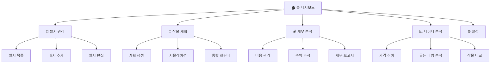

# 화면 구조 설계 및 UI/UX 가이드
## Screen Architecture & UI/UX Design Guide

---

## 📋 목차
1. [화면 구조 개요](#화면-구조-개요)
2. [디자인 시스템](#디자인-시스템)
3. [페이지별 와이어프레임](#페이지별-와이어프레임)
4. [컴포넌트 라이브러리](#컴포넌트-라이브러리)
5. [아이콘 컨셉](#아이콘-컨셉)
6. [반응형 디자인](#반응형-디자인)
7. [접근성](#접근성)

---

## 화면 구조 개요

### 전체 정보 아키텍처



### 네비게이션 구조

#### Sidebar (좌측)
```
🌾 농업 수익 최적화 플래너
├─ 🏠 홈
├─ 🌾 필지 관리
├─ 📅 작물 계획
├─ 💰 재무 관리
├─ 📊 데이터 분석
└─ ⚙️ 설정
```

---

## 디자인 시스템

### 컬러 팔레트

#### Primary Colors (주색상)
```css
/* 농업 친화적 그린 계열 */
--primary-50:  #f0fdf4;   /* 매우 연한 그린 */
--primary-100: #dcfce7;
--primary-200: #bbf7d0;
--primary-300: #86efac;
--primary-400: #4ade80;
--primary-500: #22c55e;   /* 메인 그린 */
--primary-600: #16a34a;   /* 진한 그린 */
--primary-700: #15803d;
--primary-800: #166534;
--primary-900: #14532d;
```

#### Secondary Colors (보조색상)
```css
/* 수익/성장 - 골드 계열 */
--secondary-400: #fbbf24;  /* 옐로우 골드 */
--secondary-500: #f59e0b;  /* 주황빛 골드 */
--secondary-600: #d97706;
```

#### Semantic Colors (의미색상)
```css
/* 상태 표시 */
--success: #22c55e;    /* 성공, 수익 */
--warning: #f59e0b;    /* 주의, 예정 */
--danger: #ef4444;     /* 위험, 손실 */
--info: #3b82f6;       /* 정보 */

/* 중립 */
--gray-50: #f9fafb;
--gray-100: #f3f4f6;
--gray-200: #e5e7eb;
--gray-300: #d1d5db;
--gray-500: #6b7280;
--gray-700: #374151;
--gray-900: #111827;
```

#### Background & Surface
```css
--bg-primary: #ffffff;
--bg-secondary: #f9fafb;
--bg-tertiary: #f3f4f6;
--surface: #ffffff;
--surface-elevated: #ffffff;
--border: #e5e7eb;
```

### 타이포그래피

#### Font Family
```css
/* 한글 최적화 */
font-family: 
    'Pretendard Variable',   /* 1순위: 프리텐다드 */
    'Noto Sans KR',           /* 2순위: 노토산스 */
    -apple-system,            /* macOS */
    BlinkMacSystemFont,
    'Apple SD Gothic Neo',    /* macOS 한글 */
    'Malgun Gothic',          /* Windows 한글 */
    sans-serif;

/* 숫자 강조용 (금액, 면적 등) */
font-family: 
    'Roboto Mono',
    'JetBrains Mono',
    monospace;
```

#### Font Sizes
```css
--text-xs: 0.75rem;    /* 12px - 캡션, 힌트 */
--text-sm: 0.875rem;   /* 14px - 보조 텍스트 */
--text-base: 1rem;     /* 16px - 본문 */
--text-lg: 1.125rem;   /* 18px - 강조 */
--text-xl: 1.25rem;    /* 20px - 서브헤더 */
--text-2xl: 1.5rem;    /* 24px - 헤더 */
--text-3xl: 1.875rem;  /* 30px - 페이지 타이틀 */
--text-4xl: 2.25rem;   /* 36px - 대형 숫자 */
```

#### Font Weights
```css
--font-normal: 400;
--font-medium: 500;
--font-semibold: 600;
--font-bold: 700;
```

### Spacing System
```css
--space-1: 0.25rem;   /* 4px */
--space-2: 0.5rem;    /* 8px */
--space-3: 0.75rem;   /* 12px */
--space-4: 1rem;      /* 16px */
--space-5: 1.25rem;   /* 20px */
--space-6: 1.5rem;    /* 24px */
--space-8: 2rem;      /* 32px */
--space-10: 2.5rem;   /* 40px */
--space-12: 3rem;     /* 48px */
```

### Border Radius
```css
--radius-sm: 0.25rem;   /* 4px - 작은 요소 */
--radius-md: 0.5rem;    /* 8px - 일반 카드, 버튼 */
--radius-lg: 0.75rem;   /* 12px - 큰 카드 */
--radius-xl: 1rem;      /* 16px - 모달 */
--radius-full: 9999px;  /* 원형 */
```

### Shadows
```css
--shadow-sm: 0 1px 2px 0 rgba(0, 0, 0, 0.05);
--shadow-md: 0 4px 6px -1px rgba(0, 0, 0, 0.1);
--shadow-lg: 0 10px 15px -3px rgba(0, 0, 0, 0.1);
--shadow-xl: 0 20px 25px -5px rgba(0, 0, 0, 0.1);
```

---

## 페이지별 와이어프레임

### 1. 홈 대시보드 (Home.py)

```
┌─────────────────────────────────────────────────────────┐
│  🌾 농업 수익 최적화 대시보드                              │
│  데이터 기반 영농 의사결정 지원 시스템                      │
├─────────────────────────────────────────────────────────┤
│                                                         │
│  [📊 주요 현황]                                          │
│  ┌──────────┐ ┌──────────┐ ┌──────────┐ ┌──────────┐   │
│  │ 등록필지   │ │ 총면적    │ │ 진행계획  │ │ 예상수익  │   │
│  │   5개     │ │ 1,200㎡  │ │   3개    │ │ 12,500천원│   │
│  │  +2 △    │ │ 363평    │ │  +1 △   │ │ +8.5% ↑  │   │
│  └──────────┘ └──────────┘ └──────────┘ └──────────┘   │
│                                                         │
├─────────────────────────────────────────────────────────┤
│  [📅 통합 영농 캘린더]                                    │
│  ┌─────────────────────────────────────────────────┐   │
│  │ Gantt Chart                                     │   │
│  │ 필지A - 토마토  ████████████░░░░░░░░             │   │
│  │ 필지B - 감자    ░░░░░░░████████████              │   │
│  │ 필지C - 상추    ███████░░░░░░░░░░░░              │   │
│  │                                                 │   │
│  │ 1월  2월  3월  4월  5월  6월  7월  8월         │   │
│  └─────────────────────────────────────────────────┘   │
│                                                         │
├─────────────────────────────────────────────────────────┤
│  [💰 월별 예상 순수익]                                   │
│  ┌─────────────────────────────────────────────────┐   │
│  │ Line Chart                                      │   │
│  │     ╱╲                                          │   │
│  │    ╱  ╲    ╱╲                                   │   │
│  │   ╱    ╲  ╱  ╲╱╲                                │   │
│  │  ╱      ╲╱      ╲                               │   │
│  │ 1  2  3  4  5  6  7  8  9 10 11 12 (월)        │   │
│  └─────────────────────────────────────────────────┘   │
│                                                         │
├─────────────────────────────────────────────────────────┤
│  [⏰ 이번 주 할 일]                                      │
│  ☐ 토마토 정식 (필지A) - D-3                            │
│  ☑️ 감자 비료 주기 (필지B) - 완료                        │
│  ☐ 상추 수확 (필지C) - D-5                              │
└─────────────────────────────────────────────────────────┘
```

#### 주요 요소
- **메트릭 카드**: 4개 고정 (필지, 면적, 계획, 수익)
- **Gantt Chart**: 모든 작물 일정 시각화
- **Line Chart**: 월별 수익 추이
- **Task List**: 주간 할 일

---

### 2. 필지 관리 (Fields.py)

```
┌─────────────────────────────────────────────────────────┐
│  🌾 필지 관리                      [+ 새 필지 추가] 버튼   │
├─────────────────────────────────────────────────────────┤
│                                                         │
│  [필지 목록]                                             │
│  ┌────────────────────────────────────────────────┐    │
│  │ 📍 필지 A - 토마토 하우스                        │    │
│  │ 위치: 경기도 남양주시 | 600㎡ (180평)            │    │
│  │ 시설: 비닐하우스 | pH 6.5 | EC 1.2              │    │
│  │                                                │    │
│  │ 현재 재배: 토마토 (파종: 2026-03-15)            │    │
│  │ 예상수익: 8,500,000원                          │    │
│  │                                                │    │
│  │ [상세보기] [편집] [삭제]                        │    │
│  └────────────────────────────────────────────────┘    │
│                                                         │
│  ┌────────────────────────────────────────────────┐    │
│  │ 📍 필지 B - 감자 노지                            │    │
│  │ 위치: 강원도 평창군 | 400㎡ (120평)              │    │
│  │ 시설: 노지 | pH 6.0                             │    │
│  │                                                │    │
│  │ 휴경 중                                         │    │
│  │                                                │    │
│  │ [상세보기] [편집] [삭제]                        │    │
│  └────────────────────────────────────────────────┘    │
│                                                         │
└─────────────────────────────────────────────────────────┘
```

#### 필지 추가/편집 모달
```
┌─ 필드 추가 ───────────────────────────────┐
│                                          │
│  기본 정보                                 │
│  ┌────────────────────────────────┐      │
│  │ 필지 이름 *                     │      │
│  │ [토마토 하우스 1동____________]  │      │
│  └────────────────────────────────┘      │
│                                          │
│  ┌────────────────────────────────┐      │
│  │ 위치                            │      │
│  │ [경기도 남양주시______________]  │      │
│  └────────────────────────────────┘      │
│                                          │
│  ┌──────────┐  ┌─────────────────┐      │
│  │ 면적 (㎡) │  │ 단위 [㎡ ▼]      │      │
│  │ [600____]│  │ → 181.8 평      │      │
│  └──────────┘  │ → 6.00 아르     │      │
│                │ → 0.06 헥타르   │      │
│                └─────────────────┘      │
│                                          │
│  시설 유형                                 │
│  ( ) 노지  (●) 비닐하우스                │
│  ( ) 유리온실  ( ) 스마트팜              │
│                                          │
│  토양 정보 (선택)                          │
│  ┌──────┐ ┌──────┐                      │
│  │ pH   │ │ EC   │                      │
│  │ [6.5]│ │ [1.2]│                      │
│  └──────┘ └──────┘                      │
│                                          │
│         [취소]  [저장]                   │
└──────────────────────────────────────────┘
```

---

### 3. 작물 계획 (Plan.py)

```
┌─────────────────────────────────────────────────────────┐
│  📅 작물 계획 시뮬레이션                                   │
├─────────────────────────────────────────────────────────┤
│                                                         │
│  Step 1: 필지 선택                                       │
│  ┌─────────────────────────────────────────────┐       │
│  │ 필지 선택: [토마토 하우스 1동 ▼]             │       │
│  │ 면적: 600㎡ (181평) | 비닐하우스             │       │
│  └─────────────────────────────────────────────┘       │
│                                                         │
│  Step 2: 작물 선택                                       │
│  ┌─────────────────────────────────────────────┐       │
│  │ 🔍 작물 검색: [토마토_________________]       │       │
│  │                                             │       │
│  │ 검색 결과:                                   │       │
│  │ ┌─────────────────────────────────────┐    │       │
│  │ │ 🍅 토마토                            │    │       │
│  │ │ 재배일수: 90-120일                   │    │       │
│  │ │ 기준수율: 8kg/㎡                     │    │       │
│  │ │ 현재시세: 28,000원/10kg상자 (특)    │    │       │
│  │ │                    [선택]            │    │       │
│  │ └─────────────────────────────────────┘    │       │
│  └─────────────────────────────────────────────┘       │
│                                                         │
│  Step 3: 파종 시기 설정                                  │
│  ┌─────────────────────────────────────────────┐       │
│  │ 파종 시작일: [2026-03-01]                    │       │
│  │ 파종 종료일: [2026-05-31]                    │       │
│  │ 시나리오 수: [10개]                          │       │
│  │                                             │       │
│  │              [시뮬레이션 실행]               │       │
│  └─────────────────────────────────────────────┘       │
│                                                         │
│  ━━━━━━━━━━━━━━━━━━━━━━━━━━━━━━━━━━━━━━━━━━━━━         │
│                                                         │
│  시뮬레이션 결과                                         │
│  ┌─────────────────────────────────────────────────┐   │
│  │ 파종일  │ 수확일  │ 수율  │ 예상가격 │ 순수익    │   │
│  ├─────────────────────────────────────────────────┤   │
│  │3/15 ⭐ │ 6/25   │4,800kg│32,000원 │11,240천원│   │
│  │3/01    │ 6/10   │4,500kg│28,000원 │9,850천원 │   │
│  │4/01    │ 7/15   │5,000kg│30,000원 │10,500천원│   │
│  │                  ...                           │   │
│  └─────────────────────────────────────────────────┘   │
│                                                         │
│  [📊 상세 분석 보기]  [💾 계획으로 저장]                │
└─────────────────────────────────────────────────────────┘
```

---

## 컴포넌트 라이브러리

### 1. MetricCard (메트릭 카드)

#### 디자인
```
┌────────────────────┐
│ 📊 등록 필지        │
│                    │
│      5개           │ ← 큰 숫자 (text-4xl)
│    +2 △           │ ← delta (작고 색상)
└────────────────────┘
```

#### CSS
```python
def metric_card(label, value, delta=None, icon="📊"):
    """메트릭 카드 컴포넌트"""
    st.markdown(f"""
    <div style="
        background: white;
        border-radius: var(--radius-lg);
        padding: var(--space-6);
        box-shadow: var(--shadow-sm);
        border: 1px solid var(--border);
    ">
        <div style="
            font-size: var(--text-sm);
            color: var(--gray-600);
            margin-bottom: var(--space-2);
        ">
            {icon} {label}
        </div>
        <div style="
            font-size: var(--text-4xl);
            font-weight: var(--font-bold);
            color: var(--gray-900);
            font-family: 'Roboto Mono', monospace;
        ">
            {value}
        </div>
        {f'<div style="color: var(--success); font-size: var(--text-sm);">{delta}</div>' if delta else ''}
    </div>
    """, unsafe_allow_html=True)
```

### 2. DataTable (데이터 테이블)

#### 스타일
```python
from st_aggrid import AgGrid, GridOptionsBuilder

def styled_table(dataframe, key):
    """스타일이 적용된 데이터 테이블"""
    gb = GridOptionsBuilder.from_dataframe(dataframe)
    gb.configure_default_column(
        resizable=True,
        filterable=True,
        sortable=True
    )
    gb.configure_grid_options(
        headerHeight=50,
        rowHeight=45,
        animateRows=True
    )
    
    gridOptions = gb.build()
    
    AgGrid(
        dataframe,
        gridOptions=gridOptions,
        theme='streamlit',  # 또는 'alpine', 'balham'
        height=400,
        key=key
    )
```

### 3. StatusBadge (상태 뱃지)

```python
def status_badge(status):
    """상태 뱃지"""
    colors = {
        "계획": ("var(--info)", "#eff6ff"),
        "진행중": ("var(--warning)", "#fff7ed"),
        "완료": ("var(--success)", "#f0fdf4"),
        "취소": ("var(--danger)", "#fef2f2")
    }
    
    color, bg = colors.get(status, ("gray", "#f9fafb"))
    
    return f"""
    <span style="
        display: inline-block;
        padding: 4px 12px;
        border-radius: var(--radius-full);
        background: {bg};
        color: {color};
        font-size: var(--text-sm);
        font-weight: var(--font-medium);
    ">
        {status}
    </span>
    """
```

---

## 아이콘 컨셉

### 아이콘 시스템

#### 주요 아이콘 세트
```python
ICONS = {
    # 네비게이션
    "home": "🏠",
    "field": "🌾",
    "plan": "📅",
    "finance": "💰",
    "data": "📊",
    "settings": "⚙️",
    
    # 작물/농업
    "tomato": "🍅",
    "potato": "🥔",
    "lettuce": "🥬",
    "carrot": "🥕",
    "seed": "🌱",
    "harvest": "🌾",
    
    # 상태/액션
    "add": "➕",
    "edit": "✏️",
    "delete": "🗑️",
    "search": "🔍",
    "filter": "🔽",
    "save": "💾",
    "check": "✅",
    "warning": "⚠️",
    "info": "ℹ️",
    
    # 데이터/차트
    "chart": "📈",
    "trend": "📉",
    "analytics": "📊",
    "calendar": "📅",
    
    # 날씨
    "sun": "☀️",
    "cloud": "☁️",
    "rain": "🌧️",
    "temp": "🌡️"
}
```

### 아이콘 사용 가이드

#### 1. 크기
- **Small**: 섹션 헤더 옆 (16px)
- **Medium**: 버튼, 카드 (20px)
- **Large**: 페이지 타이틀 (24px)

#### 2. 간격
- 아이콘과 텍스트 사이: 8px (`--space-2`)

#### 3. 일관성
- 같은 의미는 같은 아이콘 사용
- 색상은 디자인 시스템 준수

---

## 반응형 디자인

### Breakpoints
```python
# Streamlit columns로 반응형 구현
def responsive_layout():
    # 데스크톱 (> 1024px)
    if st.session_state.get('screen_width', 1920) > 1024:
        col1, col2, col3, col4 = st.columns(4)
        
    # 태블릿 (768px - 1024px)
    elif st.session_state.get('screen_width', 1920) > 768:
        col1, col2 = st.columns(2)
        col3, col4 = st.columns(2)
        
    # 모바일 (< 768px)
    else:
        col1 = st.container()
        col2 = st.container()
        col3 = st.container()
        col4 = st.container()
```

---

## 접근성

### 1. 색상 대비
- WCAG AA 준수 (최소 4.5:1)
- 색상만으로 정보 전달 금지 (아이콘, 텍스트 병행)

### 2. 폰트 크기
- 최소 16px (body)
- 줄간격: 1.6

### 3. 키보드 네비게이션
- Tab키로 모든 요소 접근 가능
- Focus 상태 명확하게 표시

---

**문서 버전**: 1.0  
**작성일**: 2026-01-01  
**검토 상태**: 설계
