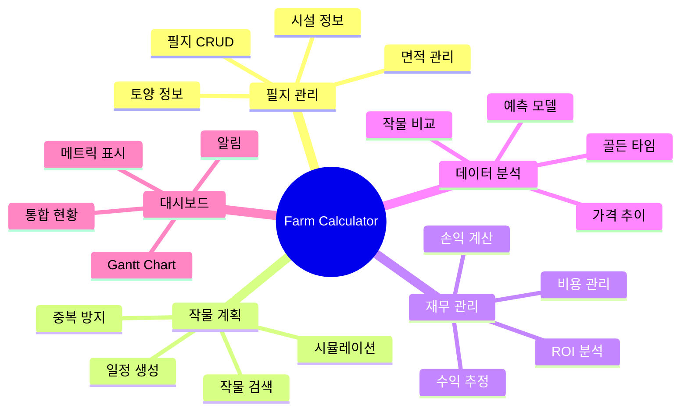

# 기능 명세서
## Feature Specifications & Implementation Roadmap

---

## 📋 목차
1. [기능 개요](#기능-개요)
2. [필지 관리](#필지-관리)
3. [작물 계획](#작물-계획)
4. [재무 관리](#재무-관리)
5. [데이터 분석](#데이터-분석)
6. [대시보드](#대시보드)
7. [설정 및 관리](#설정-및-관리)
8. [구현 로드맵](#구현-로드맵)

---

## 기능 개요

### 기능 맵



---

## 필지 관리

### F1.1 필지 등록

#### 기능 설명
사용자가 농장 필지를 시스템에 등록

#### 입력 정보
```python
{
    "name": "토마토 하우스 1동",        # 필수
    "location": "경기도 남양주시",       # 선택
    "area_sqm": 600.0,                  # 필수
    "facility_type": "비닐하우스",      # 필수
    "soil_ph": 6.5,                     # 선택
    "soil_ec": 1.2,                     # 선택
    "soil_organic_matter": 3.2,         # 선택
    "soil_nitrogen": 250,               # 선택 (mg/kg)
    "soil_phosphorus": 450,             # 선택
    "soil_potassium": 0.65              # 선택
}
```

#### 검증 규칙
| 항목 | 규칙 |
|------|------|
| 이름 | 1-100자, 중복 가능 |
| 면적 | > 0, < 1,000,000㎡ |
| 시설 유형 | "노지", "비닐하우스", "유리온실", "스마트팜" 중 하나 |
| pH | 0-14 범위 |
| EC | >= 0 |

#### 비즈니스 로직
1. 입력 검증 (Pydantic)
2. 면적 단위 자동 변환
   - 제곱미터 ↔ 평 ↔ 아르 ↔ 헥타르
3. UUID 생성
4. Database 저장
5. Session State 업데이트

#### UI 플로우
```
사용자 → [+ 새 필지 추가] 클릭
      → 모달 열림
      → 정보 입력
      → [저장] 클릭
      → 검증 실패 시 에러 메시지
      → 검증 성공 시 저장 & 모달 닫힘
      → 필지 목록에 추가됨
```

---

### F1.2 필지 조회/편집/삭제

#### 필지 조회
- **목록 보기**: 모든 필지를 카드 형태로 표시
- **필터링**: 시설 유형별, 재배 중/휴경 중
- **정렬**: 이름순, 면적순, 등록일순

#### 필지 편집
- 기존 정보 불러오기
- 수정 후 저장
- 버전 관리 (updated_at 갱신)

#### 필지 삭제
```python
# Cascade Delete
1. 해당 필지의 작물 계획 확인
2. 진행 중인 계획이 있으면 경고
3. 사용자 확인 후 삭제
4. 연관 데이터 모두 삭제 (schedules, financials)
```

---

### F1.3 토양 분석 연동

#### 기능 설명
농촌진흥청 토양 API를 통한 토양 정보 자동 조회

#### API 스펙
```python
# API Endpoint
GET https://www.rda.go.kr/api/soil/analysis

# Request
{
    "location": "경기도 남양주시",
    "api_key": "YOUR_KEY"
}

# Response
{
    "ph": 6.5,
    "ec": 1.2,
    "organic_matter": 3.2,
    "nitrogen": 250,
    "phosphorus": 450,
    "potassium": 0.65,
    "recommendation": "토마토 재배에 적합합니다"
}
```

#### 구현
```python
# backend/api_clients/soil.py
class SoilClient(BaseAPIClient):
    def get_soil_analysis(self, location: str) -> dict:
        """토양 분석 정보 조회"""
        data = self._make_request("analysis", {"location": location})
        return data
        
# 사용
soil_client = SoilClient(api_key=settings.SOIL_API_KEY)
soil_data = soil_client.get_soil_analysis("경기도 남양주시")
```

---

## 작물 계획

### F2.1 작물 선택 및 검색

#### 기능 설명
- 작물 마스터 DB에서 검색
- API 실시간 데이터 매칭

#### 검색 방식
```python
def search_crops(query: str) -> List[Crop]:
    """작물 검색"""
    # 1. 로컬 DB 검색 (한글명, 영문명)
    local_results = db.query(CropMaster).filter(
        or_(
            CropMaster.name_kr.contains(query),
            CropMaster.name_en.contains(query)
        )
    ).all()
    
    # 2. API 검색 (가락시장)
    api_results = garak_client.search_items(query)
    
    # 3. 매칭 및 병합
    merged = merge_crop_data(local_results, api_results)
    
    return merged
```

#### 표시 정보
- 작물명 (한글/영문)
- 카테고리 (채소/과채/과일/곡물)
- 재배일수 범위
- 기준 수율
- **현재 시세** (실시간 API)
- 시세 단위 (kg, 10kg상자, 20kg상자 등)

---

### F2.2 시뮬레이션 실행

#### 기능 설명
다양한 파종 시기에 대해 수익성을 시뮬레이션

#### 입력 파라미터
```python
{
    "field_id": "uuid-1234",
    "crop_name": "토마토",
    "start_date": "2026-03-01",
    "end_date": "2026-05-31",
    "scenario_count": 10
}
```

#### 시뮬레이션 로직
```python
def simulate_planting_scenarios(req: SimulationRequest) -> SimulationResponse:
    """파종 시기별 시뮬레이션"""
    
    # 1. 날짜 범위 생성
    dates = generate_date_range(req.start_date, req.end_date, req.scenario_count)
    
    scenarios = []
    for planting_date in dates:
        # 2. 수확일 계산
        harvest_date = calculate_harvest_date(planting_date, req.crop_name)
        
        # 3. 수율 추정
        yield_kg = estimate_yield(
            field=get_field(req.field_id),
            crop=req.crop_name,
            planting_date=planting_date
        )
        
        # 4. 가격 예측
        predicted_price = predict_price(
            crop=req.crop_name,
            target_date=harvest_date
        )
        
        # 5. 수익/비용 계산
        revenue = yield_kg * predicted_price
        cost = estimate_cost(req.field_id, req.crop_name)
        profit = revenue - cost
        roi = (profit / cost) * 100
        
        # 6. 신뢰도 점수
        confidence = calculate_confidence(
            price_data_quality,
            weather_uncertainty,
            time_distance
        )
        
        scenarios.append(SimulationScenario(
            planting_date=planting_date,
            harvest_date=harvest_date,
            estimated_yield_kg=yield_kg,
            avg_price_per_kg=predicted_price,
            estimated_revenue=revenue,
            estimated_cost=cost,
            net_profit=profit,
            roi=roi,
            confidence_score=confidence
        ))
    
    # 최적 시나리오 선정 (순수익 최대)
    optimal = max(scenarios, key=lambda x: x.net_profit)
    
    return SimulationResponse(
        scenarios=scenarios,
        optimal_scenario=optimal,
        analysis_timestamp=datetime.now()
    )
```

#### 가격 예측 모델
```python
def predict_price(crop: str, target_date: date) -> float:
    """가격 예측 (5년 평균 + 추세)"""
    
    # 1. 과거 5년 데이터 조회
    historical = get_historical_prices(crop, years=5)
    
    # 2. 시즌성 분석
    target_month = target_date.month
    monthly_avg = historical.groupby('month')['price'].mean()
    seasonal_price = monthly_avg[target_month]
    
    # 3. 추세 분석 (선형 회귀)
    trend = calculate_price_trend(historical)
    
    # 4. 최종 예측
    predicted = seasonal_price * (1 + trend)
    
    return predicted
```

---

### F2.3 계획 저장 및 관리

#### 계획 저장
```python
def save_crop_plan(scenario: SimulationScenario, field_id: str):
    """선택한 시나리오를 계획으로 저장"""
    
    # 1. 일정 중복 검사
    conflicts = check_schedule_conflict(field_id, scenario.planting_date, scenario.harvest_date)
    if conflicts:
        raise ValueError("다른 작물 계획과 일정이 겹칩니다")
    
    # 2. 계획 생성
    plan = CropPlan(
        id=generate_uuid(),
        field_id=field_id,
        crop_name=scenario.crop_name,
        planting_date=scenario.planting_date,
        expected_harvest_date=scenario.harvest_date,
        estimated_yield_kg=scenario.estimated_yield_kg,
        estimated_revenue=scenario.estimated_revenue,
        estimated_cost=scenario.estimated_cost,
        status="계획"
    )
    
    db.add(plan)
    db.commit()
    
    # 3. 일정 자동 생성
    generate_schedules(plan)
    
    return plan
```

#### 자동 일정 생성
```python
def generate_schedules(plan: CropPlan):
    """작물 계획에 따른 일정 자동 생성"""
    
    schedules = []
    
    # 파종
    schedules.append(Schedule(
        plan_id=plan.id,
        task_type="파종",
        scheduled_date=plan.planting_date
    ))
    
    # 정식 (파종 후 30일, 시설재배인 경우)
    if is_facility_crop(plan.crop_name):
        schedules.append(Schedule(
            plan_id=plan.id,
            task_type="정식",
            scheduled_date=plan.planting_date + timedelta(days=30)
        ))
    
    # 비료 (정기적: 2주마다)
    current_date = plan.planting_date
    while current_date < plan.expected_harvest_date:
        current_date += timedelta(days=14)
        schedules.append(Schedule(
            plan_id=plan.id,
            task_type="비료",
            scheduled_date=current_date
        ))
    
    # 수확
    schedules.append(Schedule(
        plan_id=plan.id,
        task_type="수확",
        scheduled_date=plan.expected_harvest_date
    ))
    
    db.bulk_save_objects(schedules)
    db.commit()
```

---

## 재무 관리

### F3.1 수익 추정

#### 공식
```
예상 수익 = 예상 수율(kg) × 예상 단가(원/kg)
```

#### 구현
```python
def calculate_revenue(yield_kg: float, price_per_kg: float) -> float:
    """수익 계산"""
    return yield_kg * price_per_kg
```

---

### F3.2 비용 추정

#### 비용 항목
```python
COST_ITEMS = {
    "seed": "종자/종묘비",
    "fertilizer": "비료비",
    "pesticide": "농약비",
    "labor": "인건비",
    "utility": "광열비",
    "other": "기타"
}
```

#### 표준 비용 데이터
```python
# data/standard_costs.json
{
    "토마토": {
        "비닐하우스": {
            "seed_per_sqm": 1500,        # 원/㎡
            "fertilizer_per_sqm": 800,
            "pesticide_per_sqm": 600,
            "labor_per_sqm": 2000,
            "utility_per_sqm": 1000
        }
    }
}
```

#### 비용 계산
```python
def estimate_cost(field_id: str, crop: str) -> float:
    """비용 추정"""
    
    field = get_field(field_id)
    area = field.area_sqm
    facility = field.facility_type
    
    # 표준 비용 조회
    standards = load_standard_costs()
    cost_per_sqm = standards[crop][facility]
    
    # 총 비용 계산
    total = (
        cost_per_sqm["seed_per_sqm"] * area +
        cost_per_sqm["fertilizer_per_sqm"] * area +
        cost_per_sqm["pesticide_per_sqm"] * area +
        cost_per_sqm["labor_per_sqm"] * area +
        cost_per_sqm["utility_per_sqm"] * area
    )
    
    # 사용자 커스터마이징 적용 (있으면)
    if field.custom_costs:
        total = apply_custom_costs(total, field.custom_costs)
    
    return total
```

---

### F3.3 실제 재무 기록

#### 수확 후 기록
```python
def record_actual_financial(plan_id: str, data: dict):
    """실제 수익/비용 기록"""
    
    record = FinancialRecord(
        plan_id=plan_id,
        actual_yield_kg=data["actual_yield_kg"],
        actual_price_per_kg=data["actual_price_per_kg"],
        actual_revenue=data["actual_yield_kg"] * data["actual_price_per_kg"],
        seed_cost=data.get("seed_cost", 0),
        fertilizer_cost=data.get("fertilizer_cost", 0),
        pesticide_cost=data.get("pesticide_cost", 0),
        labor_cost=data.get("labor_cost", 0),
        utility_cost=data.get("utility_cost", 0),
        other_cost=data.get("other_cost", 0),
        record_date=date.today()
    )
    
    db.add(record)
    db.commit()
    
    # 계획 상태 업데이트
    plan = db.query(CropPlan).get(plan_id)
    plan.status = "수확완료"
    plan.actual_harvest_date = date.today()
    db.commit()
    
    return record
```

---

## 데이터 분석

### F4.1 가격 추이 분석

#### 기능
- 과거 5년 가격 데이터 시각화
- 월별/계절별 평균
- 최고/최저 가격
- 변동성 지표

#### 차트
```python
import plotly.graph_objects as go

def plot_price_trend(crop: str):
    """가격 추이 차트"""
    
    # 데이터 조회
    prices = get_historical_prices(crop, years=5)
    
    # Plotly 차트
    fig = go.Figure()
    
    # 일별 가격
    fig.add_trace(go.Scatter(
        x=prices['date'],
        y=prices['price'],
        mode='lines',
        name='일별 가격',
        line=dict(color='lightgray', width=1)
    ))
    
    # 월별 평균
    monthly = prices.groupby(prices['date'].dt.to_period('M'))['price'].mean()
    fig.add_trace(go.Scatter(
        x=monthly.index.to_timestamp(),
        y=monthly.values,
        mode='lines+markers',
        name='월평균',
        line=dict(color='var(--primary-500)', width=3)
    ))
    
    fig.update_layout(
        title=f"{crop} 가격 추이 (최근 5년)",
        xaxis_title="날짜",
        yaxis_title="가격 (원/kg)",
        hovermode='x unified'
    )
    
    st.plotly_chart(fig, use_container_width=True)
```

---

### F4.2 골든 타임 분석

#### 정의
최고 가격이 예상되는 수확 시기

#### 알고리즘
```python
def find_golden_time(crop: str) -> dict:
    """골든 타임 분석"""
    
    # 5년 데이터 조회
    prices = get_historical_prices(crop, years=5)
    
    # 월별 평균 가격
    monthly_avg = prices.groupby(prices['date'].dt.month).agg({
        'price': ['mean', 'std', 'max']
    })
    
    # 가장 높은 평균 가격의 월
    golden_month = monthly_avg['price']['mean'].idxmax()
    
    # 신뢰도 계산 (변동성 고려)
    cv = monthly_avg.loc[golden_month, ('price', 'std')] / monthly_avg.loc[golden_month, ('price', 'mean')]
    confidence = 1 - cv  # 변동계수가 낮을수록 신뢰도 높음
    
    return {
        "month": golden_month,
        "avg_price": monthly_avg.loc[golden_month, ('price', 'mean')],
        "max_price": monthly_avg.loc[golden_month, ('price', 'max')],
        "confidence": confidence,
        "recommendation": f"{golden_month}월 수확 시 최고 가격 예상"
    }
```

---

## 대시보드

### F5.1 주요 메트릭

#### 표시 항목
1. **등록 필지**: 총 필지 수
2. **총 재배 면적**: 합계 면적 (㎡, 평)
3. **진행 중인 계획**: status='진행중'인 계획 수
4. **연간 예상 순수익**: 모든 계획의 순수익 합계

#### 구현
```python
def get_dashboard_metrics():
    """대시보드 메트릭 계산"""
    
    fields = db.query(Field).filter(Field.is_active == True).all()
    plans = db.query(CropPlan).filter(CropPlan.status.in_(['계획', '진행중'])).all()
    
    total_fields = len(fields)
    total_area_sqm = sum(f.area_sqm for f in fields)
    active_plans = len([p for p in plans if p.status == '진행중'])
    estimated_profit = sum(p.estimated_profit or 0 for p in plans)
    
    return {
        "total_fields": total_fields,
        "total_area_sqm": total_area_sqm,
        "total_area_pyeong": total_area_sqm / 3.3,
        "active_plans": active_plans,
        "estimated_annual_profit": estimated_profit
    }
```

---

### F5.2 통합 캘린더 (Gantt Chart)

#### 데이터 준비
```python
def prepare_gantt_data():
    """Gantt Chart용 데이터"""
    
    plans = db.query(CropPlan).filter(CropPlan.status != '취소').all()
    
    data = []
    for plan in plans:
        field = get_field(plan.field_id)
        data.append({
            "Task": f"{field.name} - {plan.crop_name}",
            "Start": plan.planting_date,
            "Finish": plan.expected_harvest_date,
            "Status": plan.status
        })
    
    return pd.DataFrame(data)
```

#### Plotly Gantt Chart
```python
import plotly.express as px

def plot_gantt_chart(df):
    """Gantt Chart 시각화"""
    
    fig = px.timeline(
        df,
        x_start="Start",
        x_end="Finish",
        y="Task",
        color="Status",
        color_discrete_map={
            "계획": "#3b82f6",
            "진행중": "#f59e0b",
            "수확완료": "#22c55e"
        }
    )
    
    fig.update_yaxes(categoryorder="total ascending")
    fig.update_layout(
        title="통합 영농 일정",
        xaxis_title="기간",
        yaxis_title="필지 - 작물",
        height=400
    )
    
    st.plotly_chart(fig, use_container_width=True)
```

---

## 설정 및 관리

### F6.1 API 키 관리

#### 설정 파일
```python
# config/.env
WEATHER_API_KEY=your_weather_key
SOIL_API_KEY=your_soil_key
PRICE_API_KEY=your_price_key
```

#### UI에서 설정
```python
# pages/Settings.py
st.subheader("⚙️ API 설정")

with st.form("api_settings"):
    weather_key = st.text_input("기상청 API 키", type="password")
    soil_key = st.text_input("농진청 토양 API 키", type="password")
    price_key = st.text_input("KAMIS API 키", type="password")
    
    if st.form_submit_button("저장"):
        save_api_keys(weather_key, soil_key, price_key)
        st.success("API 키가 저장되었습니다")
```

---

## 구현 로드맵

### Phase 1: MVP (4주) ✅ 완료

| 주차 | 작업 | 상태 |
|------|------|------|
| 1주차 | 프로젝트 초기 설정, 기본 구조 | ✅ |
| 2주차 | 필지 관리 기본 CRUD | ✅ |
| 3주차 | API 클라이언트 구현 | ✅ |
| 4주차 | 단순 수익 계산 로직 | ✅ |

### Phase 2: 고도화 (6주) 🔄 진행 중

| 주차 | 작업 | 우선순위 | 예상 시간 |
|------|------|----------|----------|
| 1주차 | 📋 **문서화 완료** | P0 | 8h |
| 2주차 | 시뮬레이션 엔진 구현 | P0 | 16h |
| 3주차 | 가격 예측 모델 개선 | P1 | 12h |
| 4주차 | 대시보드 UI 고도화 | P1 | 12h |
| 5주차 | 데이터 분석 기능 | P2 | 10h |
| 6주차 | 테스트 및 버그 수정 | P0 | 10h |

### Phase 3: 확장 (4주) 📅 계획

| 기능 | 설명 | 우선순위 |
|------|------|----------|
| 모바일 최적화 | 반응형 디자인 개선 | P2 |
| 데이터 내보내기 | Excel, PDF 리포트 | P1 |
| 알림 기능 | 작업 일정 리마인더 | P2 |
| 다국어 지원 | 영어 지원 | P3 |

---

**문서 버전**: 1.0  
**작성일**: 2026-01-01  
**검토 상태**: 설계
