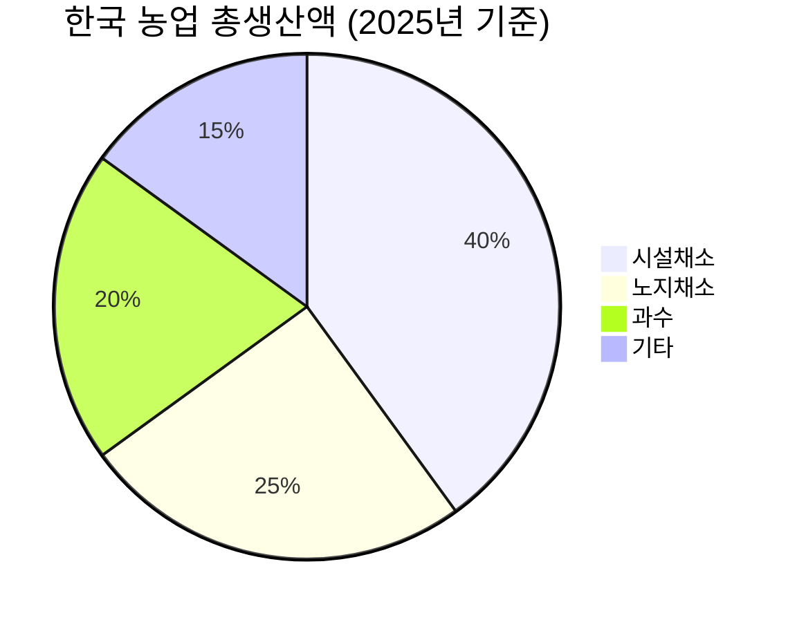
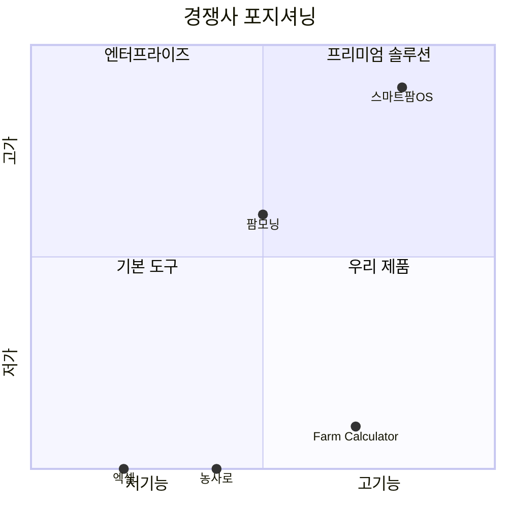
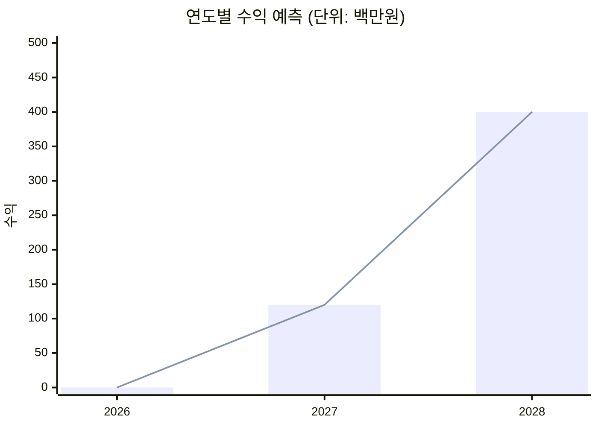
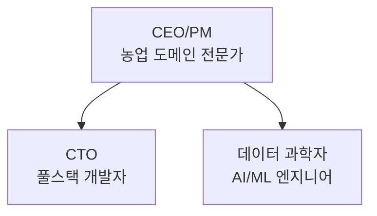
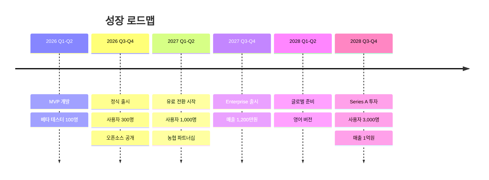
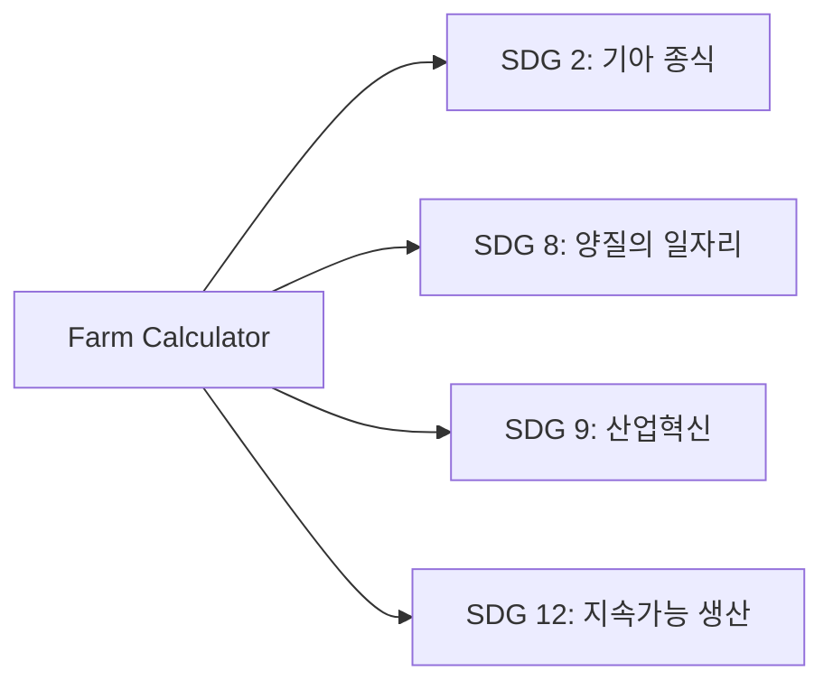

# 사업계획서
## Farm Calculator Business Plan

---

## 📋 목차
1. [Executive Summary](#executive-summary)
2. [시장 분석](#시장-분석)
3. [경쟁 분석](#경쟁-분석)
4. [비즈니스 모델](#비즈니스-모델)
5. [Go-to-Market 전략](#go-to-market-전략)
6. [재무 계획](#재무-계획)
7. [팀 구성](#팀-구성)
8. [리스크 및 대응](#리스크-및-대응)
9. [성장 전략](#성장-전략)

---

## Executive Summary

### 회사 개요
- **회사명**: Farm Calculator (가칭)
- **설립**: 2026년 (예정)
- **업종**: AgTech (Agricultural Technology)
- **핵심 제품**: 데이터 기반 영농 수익 최적화 플랫폼

### 미션
> "데이터로 농업의 불확실성을 줄이고, 농업인의 수익성을 극대화한다"

### 비전
> "2030년까지 대한민국 스마트팜 농가의 50%가 사용하는 필수 영농 도구"

### 핵심 가치 제안
1. **수익 예측 정확도 70% 이상**: 과거 5년 데이터 기반 가격 예측
2. **의사결정 시간 90% 단축**: 파종 시기 결정에 3분
3. **무료 + 오픈소스**: 누구나 무료로 사용, 커뮤니티 기반 개선

### 타겟 시장
- **1차**: 중소규모 시설농가 (연매출 5천만~2억)
- **TAM**: 한국 시설농가 약 50,000호
- **SAM**: 스마트팜 관심 농가 10,000호
- **SOM**: 초기 3년 목표 1,000호

---

## 시장 분석

### 시장 규모

#### 한국 농업 시장


| 항목 | 수치 |
|------|------|
| 전체 농가 수 | 약 140만 호 |
| 시설농가 수 | 약 5만 호 |
| 스마트팜 농가 | 약 7천 호 (증가 추세) |
| 연간 농업 총생산액 | 약 50조 원 |

#### 시장 세분화

##### TAM (Total Addressable Market)
- **대상**: 전체 시설농가
- **규모**: 50,000호 × 평균 연매출 1억 = **5조 원**

##### SAM (Serviceable Addressable Market)
- **대상**: 디지털 도구 사용 가능한 농가
- **비율**: 20% (10,000호)
- **규모**: 10,000호 × 1억 = **1조 원**

##### SOM (Serviceable Obtainable Market)
- **목표**: 3년 내 10% 점유
- **규모**: 1,000호 × 1억 = **1,000억 원**

---

### 시장 트렌드

#### 1. 스마트팜 보급 확대
- 정부 지원 사업 지속 (농림축산식품부)
- 청년 농업인 증가
- ICT 융복합 확산

#### 2. 데이터 농업 수요 증가
- 농업인 평균 연령 하락 (58세 → 55세)
- 스마트폰 보급률 90% 이상
- 데이터 기반 의사결정 선호

#### 3. 공공 데이터 개방
- KAMIS (농산물 유통 정보) API
- 기상청 날씨 데이터
- 농촌진흥청 재배 기술 정보

#### 성장 전망
```
2026년: 1,000억 원 (SAM)
2027년: 1,500억 원 (+50%)
2028년: 2,200억 원 (+47%)
```

---

## 경쟁 분석

### 경쟁사 맵핑



### 주요 경쟁사

#### 1. 스마트팜OS (KT)
| 항목 | 내용 |
|------|------|
| 강점 | 대기업 신뢰, 하드웨어 통합 |
| 약점 | 고가 (월 20만원~), 복잡한 설치 |
| 타겟 | 대규모 스마트팜 |
| 시장점유율 | 약 5% |

#### 2. 팜모닝
| 항목 | 내용 |
|------|------|
| 강점 | 커뮤니티, 일지 기능 |
| 약점 | 수익 예측 기능 없음 |
| 타겟 | 전체 농업인 |
| 시장점유율 | 약 10% |

#### 3. 농사로 (농진청)
| 항목 | 내용 |
|------|------|
| 강점 | 무료, 공공 신뢰 |
| 약점 | 정보 제공만, 분석 없음 |
| 타겟 | 전체 농업인 |
| 시장점유율 | 높음 (정보 조회) |

#### 4. 엑셀 (자체 관리)
| 항목 | 내용 |
|------|------|
| 강점 | 무료, 익숙함 |
| 약점 | 수동, 데이터 연동 없음 |
| 타겟 | 모든 사용자 |
| 시장점유율 | 약 30% |

---

### 경쟁 우위

| 요소 | 우리 | 경쟁사 평균 |
|------|------|-------------|
| **가격** | 무료 (오픈소스) | 월 5~20만원 |
| **수익 예측** | AI 기반 시뮬레이션 | 없음 or 단순 |
| **진입 장벽** | 낮음 (3분 설치) | 높음 (1일 교육) |
| **오프라인** | 가능 (Local-First) | 불가능 (클라우드) |
| **커스터마이징** | 오픈소스 개방 | 불가능 |

---

## 비즈니스 모델

### 수익 모델

#### Phase 1: 무료 + 오픈소스 (0-2년)
```
목표: 사용자 확보 & 데이터 축적
수익: 없음 (투자 또는 보조금)
```

#### Phase 2: Freemium (2-3년)
```python
# 무료 기능
- 필지 관리 (최대 3개)
- 기본 시뮬레이션
- 가격 정보 조회

# 유료 기능 (월 19,000원)
- 무제한 필지
- 고급 분석 (골든 타임, 작물 비교)
- 데이터 내보내기 (Excel, PDF)
- 우선 고객 지원
```

#### Phase 3: Enterprise (3년 이후)
```
대상: 농협, 지자체, 영농조합
가격: 연 500만원~
기능:
  - 다중 농가 통합 관리
  - 커스텀 리포트
  - API 제공
  - 전담 서포트
```

### 수익 예측 (3년)



| 연도 | 사용자 수 | 유료 전환율 | 월 ARPU | 연간 수익 |
|------|-----------|-------------|---------|----------|
| 2026 | 300명 | 0% | 0원 | **0원** |
| 2027 | 1,000명 | 10% | 19,000원 | **1,200만원** |
| 2028 | 3,000명 | 15% | 19,000원 | **1억 200만원** |

---

## Go-to-Market 전략

### 고객 획득 전략

#### 1. 커뮤니티 마케팅
```
- 농업 커뮤니티 (네이버 카페, 유튜브)
- 오픈소스 기여자 모집
- 사용 후기 공유 이벤트
```

#### 2. 파트너십
```
농협 → 조합원 배포
지자체 → 귀농귀촌 교육
농업 유튜버 → 리뷰 콘텐츠
```

#### 3. SEO & 콘텐츠
```
블로그: "토마토 재배 수익 계산"
YouTube: "스마트팜 수익 시뮬레이션"
SNS: 인스타그램, 페이스북 농업 그룹
```

### 고객 유지 전략

#### 1. 지속적인 가치 제공
- 주간 가격 리포트 이메일
- 월간 수익 분석 리포트
- 시즌별 재배 추천

#### 2. 커뮤니티 구축
- 사용자 포럼
- 성공 사례 공유
- 오프라인 모임 (농업인의 날)

---

## 재무 계획

### 초기 투자 (1년차)

| 항목 | 금액 |
|------|------|
| 개발 인건비 (2명 × 12개월 × 500만원) | 1억 2천만원 |
| 서버 및 인프라 | 500만원 |
| 마케팅 | 1,000만원 |
| 법인 설립 및 운영 | 500만원 |
| **총계** | **1억 4천만원** |

### 손익 계산 (3년)

```
                 2026년    2027년    2028년
매출              0원    1,200만원  1억200만원
비용          1.4억원    1.0억원   1.5억원
───────────────────────────────────────────
순손익        -1.4억원   -8,800만원 -4,800만원
누적손익      -1.4억원   -2.28억원  -2.76억원
```

### 자금 조달 계획

#### Seed Round (2026년)
- **목표 금액**: 2억 원
- **용도**: 개발, 운영, 마케팅
- **투자자**: 엔젤, 액셀러레이터

#### Series A (2028년)
- **목표 금액**: 10억 원
- **용도**: 팀 확장, 글로벌 진출
- **투자자**: VC (Venture Capital)

---

## 팀 구성

### 초기 팀 (3명)



#### 역할
| 직책 | 역할 | 요구 역량 |
|------|------|-----------|
| **CEO/PM** | 전략, 파트너십, 제품 기획 | 농업 경험, 비즈니스 개발 |
| **CTO** | 개발, 아키텍처, DevOps | Python, Streamlit, API |
| **Data Scientist** | 가격 예측, 분석 모델 | ML, 통계, pandas |

### 확장 팀 (2년차)
- **마케터** (디지털 마케팅, 커뮤니티)
- **고객 지원** (CS, 교육)
- **UX 디자이너**

---

## 리스크 및 대응

### 주요 리스크

#### 1. 기술적 리스크
| 리스크 | 확률 | 영향 | 대응 방안 |
|--------|------|------|-----------|
| API 서비스 중단 | 중 | 높 | 다중 출처, 캐싱 |
| 예측 정확도 낮음 | 중 | 높 | 지속적 모델 개선 |
| 성능 이슈 | 낮 | 중 | 최적화, 클라우드 |

#### 2. 시장 리스크
| 리스크 | 확률 | 영향 | 대응 방안 |
|--------|------|------|-----------|
| 사용자 확보 실패 | 중 | 높 | 무료 + 마케팅 강화 |
| 대기업 진입 | 중 | 중 | 오픈소스 생태계 구축 |
| 규제 변화 | 낮 | 중 | 정부 협업 |

#### 3. 재무 리스크
| 리스크 | 확률 | 영향 | 대응 방안 |
|--------|------|------|-----------|
| 투자 유치 실패 | 중 | 높 | 보조금, 크라우드펀딩 |
| 수익화 지연 | 중 | 중 | Burn Rate 관리 |

---

## 성장 전략

### 3년 로드맵



### KPI (핵심 성과 지표)

#### 사용자 지표
- **DAU/MAU**: 일간/월간 활성 사용자
- **Retention**: 월간 유지율 > 60%
- **NPS**: Net Promoter Score > 50

#### 비즈니스 지표
- **CAC**: Customer Acquisition Cost < 50,000원
- **LTV**: Lifetime Value > 500,000원
- **Churn Rate**: 이탈률 < 5%/월

#### 제품 지표
- **예측 정확도**: > 70%
- **평균 응답 시간**: < 2초
- **사용자 만족도**: > 4.0/5.0

---

## 사회적 가치

### SDGs (지속가능발전목표) 기여



### 임팩트
1. **농업인 소득 증대**: 수익성 10% 향상
2. **식량 안보**: 효율적 생산 계획
3. **청년 유입**: 데이터 기반 매력적 직업
4. **환경 보호**: 과잉 투입 방지

---

## 마일스톤

### 2026년
- ✅ Q1: 개발 완료
- ⬜ Q2: 베타 테스트
- ⬜ Q3: 정식 출시
- ⬜ Q4: 사용자 300명 달성

### 2027년
- ⬜ Q1: 유료 모델 출시
- ⬜ Q2: 사용자 1,000명
- ⬜ Q3: Enterprise 출시
- ⬜ Q4: 첫 매출 1,000만원

### 2028년
- ⬜ Q1: 사용자 3,000명
- ⬜ Q2: Series A 투자
- ⬜ Q3: 글로벌 진출
- ⬜ Q4: 연 매출 1억원

---

## Exit 전략

### 옵션 1: 인수합병 (M&A)
- **잠재 인수자**: KT, SK, 농협
- **시기**: 3-5년
- **밸류에이션**: 100-300억

### 옵션 2: IPO
- **시기**: 5-7년
- **조건**: 연 매출 50억 이상
- **시장**: KOSDAQ

### 옵션 3: 지속 운영
- **오픈소스 재단**: Apache Foundation 스타일
- **수익**: Enterprise + 기부

---

**문서 버전**: 1.0  
**작성일**: 2026-01-01  
**검토 상태**: 초안  
**기밀 등급**: 대외비
